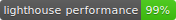

# Frogger-Arcade Game Clone
This is a variation of the classic Frogger arcade game. In this project HTML `<canvas>` is used to render game screen and characters. To abstract out the functionaliy of player and enemies in the game, ES6 classes are used. 

The project is based on starter code as well assets from [this repository](https://github.com/udacity/frontend-nanodegree-arcade-game).

## How to Play
**Goal**: The goal of the game is to get to the sea without being hit by any enemies(bugs). 

**Game Controls**: Use `up`, `down`, `left` and `right` arrow keys to control the character's movement and avoid enemies. 

**Lives**: The player has 3 lives to complete the game and with each collision with the bugs a life is lost and player position is reset.

**Character**: The player can also choose a character from five different sprite options.

## Built with
- [HTML Canvas](https://developer.mozilla.org/en-US/docs/Web/API/Canvas_API) - `<canvas>` element is used to draw graphics, on the fly, via JavaScript.
- [JavaScript Classes](https://developer.mozilla.org/en-US/docs/Web/JavaScript/Reference/Classes) - Syntactical sugar over JavaScript's prototype-based inheritance.
- [CSS Flexbox](https://www.w3schools.com/css/css3_flexbox.asp) -  CSS layout module to design flexible responsive layout structure without using float or positioning.
- [Google Fonts](https://fonts.google.com/) - A library of 900 libre licensed fonts
- [gulp](https://www.npmjs.com/package/gulp) Plugins - browser-sync, gulp-prettier, gulp-autoprefixer

## Live Version
Start playing [here](https://ssaleem.github.io/Frogger-Clone/).

